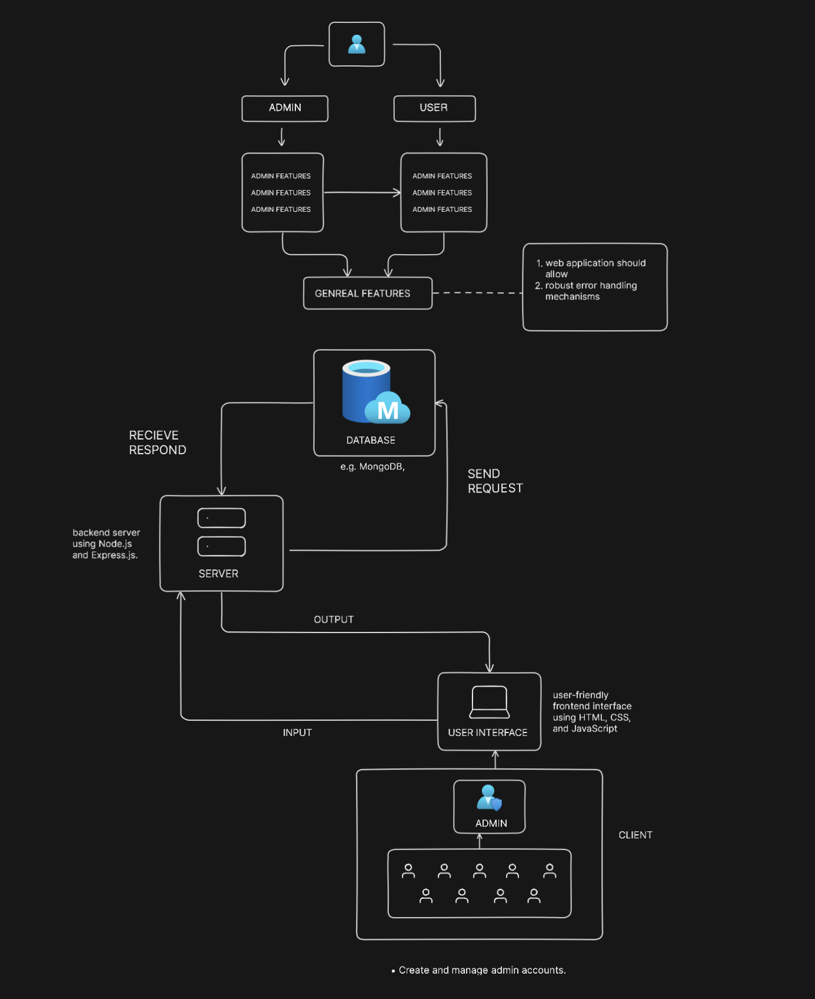

# Task-Manager
# Fullstack Task Manager (MERN)

## Overview

The Cloud-Based Task Manager is a sophisticated web application designed to optimize team task management. Utilizing the MERN stack (MongoDB, Express.js, React, and Node.js), this platform offers an intuitive interface for efficient task assignment, tracking, and collaboration. It serves both administrators and regular users, providing an array of features to boost productivity and organization.

## Why/Problem?

In today's fast-paced work environments, effective task management is essential for team success. Traditional methods, such as spreadsheets or manual tracking systems, are often cumbersome and prone to errors. The Cloud-Based Task Manager addresses these issues by providing a centralized platform for task management, facilitating seamless collaboration, and enhancing workflow efficiency.



## Background

With the increase in remote work and dispersed teams, the demand for tools that enable effective communication and task coordination has surged. The Cloud-Based Task Manager meets this need by leveraging modern web technologies to create a responsive and user-friendly task management solution. The use of the MERN stack ensures scalability, while integration with Redux Toolkit, Headless UI, and Tailwind CSS enhances user experience and performance.


## Admin Features

### User Management

- Create and manage admin accounts.
- Add and manage team members.

### Task Assignment

- Assign tasks to individual or multiple users.
- Update task details and statuses.

### Task Properties

- Label tasks as to-do, in-progress, or completed.
- Assign priority levels (high, medium, normal, low).
- Add and manage sub-tasks.

### Asset Management

- Upload task-related assets, such as images.

### User Account Control

- Disable or activate user accounts.
- Permanently delete or trash tasks.

## User Features

### Task Interaction

- Change task status (in-progress or completed).
- View detailed task information.

### Communication

- Add comments or chat within task activities.

## General Features

### Authentication and Authorization

- Secure user login.
- Role-based access control.

### Profile Management

- Update user profiles.

### Password Management

- Securely change passwords.

### Dashboard

- Summarize user activities.
- Filter tasks into to-do, in-progress, or completed.

## Technologies Used

### Frontend

- React (with Vite)
- Redux Toolkit for State Management
- Headless UI
- Tailwind CSS

### Backend

- Node.js with Express.js

### Database

- MongoDB for efficient and scalable data storage.

The Cloud-Based Task Manager is an innovative solution that enhances task management efficiency within teams. By leveraging the MERN stack and modern frontend technologies, the platform offers a seamless experience for both administrators and users, promoting collaboration and productivity.

## Setup Instructions

### Server Setup

#### Environment Variables

First, create an environment variables file named `.env` in the server folder. The `.env` file should include the following environment variables:

```plaintext
MONGODB_URI=your MongoDB URL
JWT_SECRET=any secure secret key
PORT=8800 or any preferred port number
NODE_ENV=development
```

#### Set Up MongoDB

1. **Visit MongoDB Atlas Website**
   - Go to [MongoDB Atlas](https://www.mongodb.com/cloud/atlas).

2. **Create an Account**
   - Log in to your MongoDB Atlas account.

3. **Create a New Cluster**
   - Choose a Cloud Provider and Region.
   - Configure Cluster Settings.
   - Create Cluster.
   - Wait for the cluster to deploy.

4. **Create Database User**
   - Set up an IP Whitelist.
   - Connect to Cluster.
   - Configure your application.
   - Test the connection.

5. **Configure `.env` File**
   - Create a new database and configure the `.env` file with the MongoDB connection URL.

#### Steps to Run Server

1. Open the project in your preferred code editor.
2. Navigate to the server directory: `cd server`.
3. Install the necessary packages: `npm i` or `npm install`.
4. Start the server: `npm start`.

If configured correctly, you should see a message indicating that the server is running successfully and the database is connected.

### Client-Side Setup

#### Environment Variables

First, create an environment variables file named `.env` in the client folder. The `.env` file should include the following environment variables:

```plaintext
VITE_APP_BASE_URL=http://localhost:8800 # Change the port 8800 if using a different port.
VITE_APP_FIREBASE_API_KEY=your Firebase API key
```

#### Steps to Run Client

1. Navigate to the client directory: `cd client`.
2. Install the necessary packages: `npm i` or `npm install`.
3. Start the app: `npm start`.

Open [http://localhost:3000](http://localhost:3000) in your browser to view the application.
